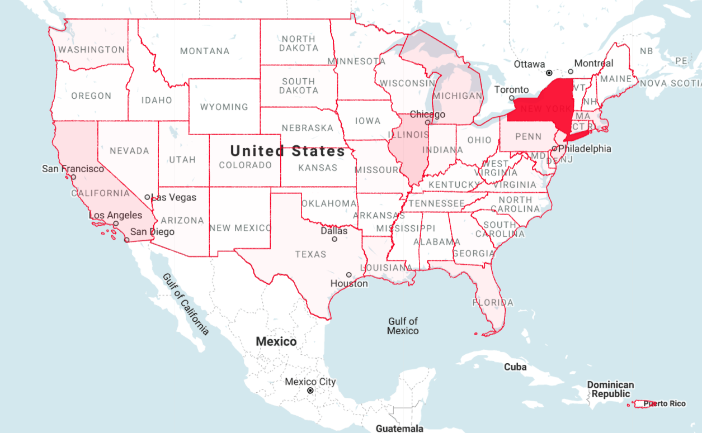
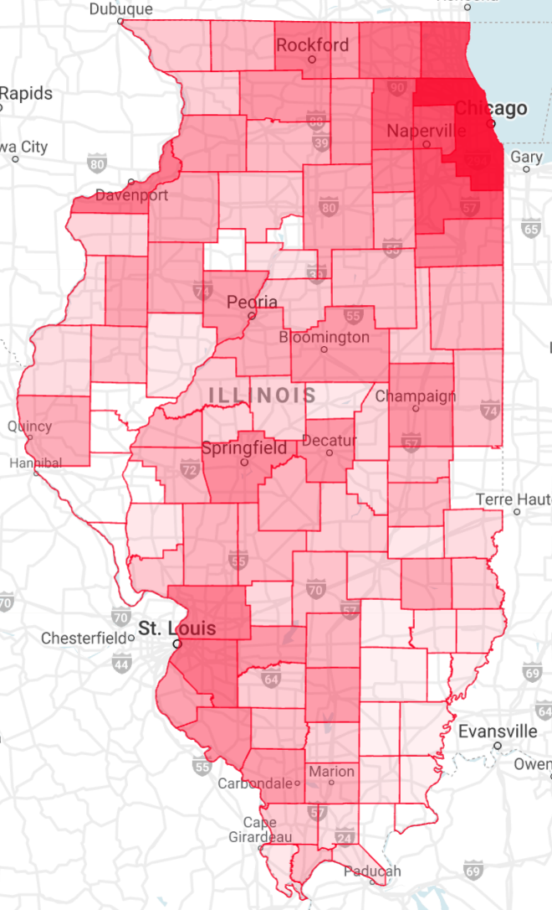
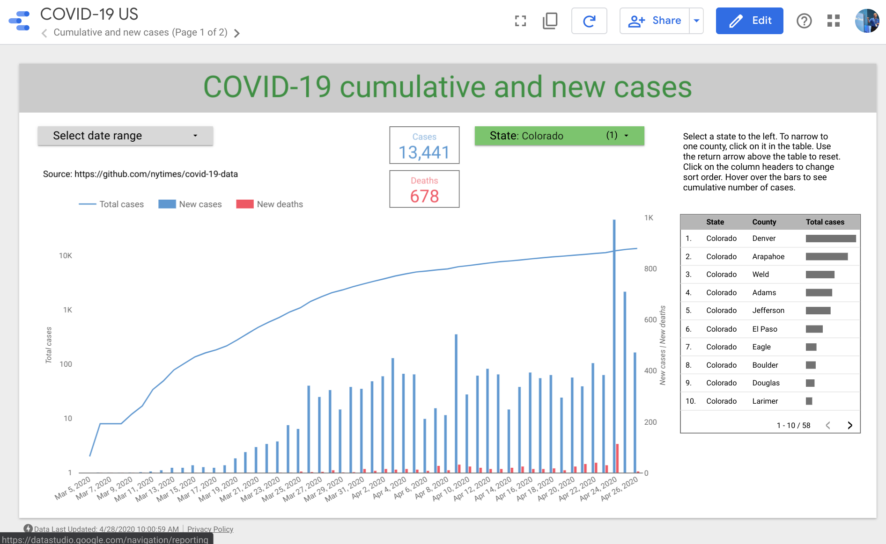

# Create a Pipeline, Map, and Dashboard for COVID-19 US Data

by [_David Chandler_](https://turbomanage.wordpress.com)<br>
Technical Instructor, Google Cloud Platform

The New York Times is publishing COVID-19 data on a county-by-county basis daily. In this post, we create a pipeline to import the data into BigQuery daily and then create a map and DataStudio dashboard to visualize the data. Near the time of this writing, the NYT data became available as a BigQuery public dataset [bigquery-public-data.covid19_nyt.us_counties](https://console.cloud.google.com/bigquery?p=bigquery-public-data&d=covid19_nyt&t=us_counties&page=table). However, that dataset does not include the supplementary views and tables discussed in these instructions.

## Explore the Data
First let's look at the sample data from the [NYT repo on Github](https://raw.githubusercontent.com/nytimes/covid-19-data/master/):

```csv
us-counties.csv:

date,county,state,fips,cases,deaths
2020-01-21,Snohomish,Washington,53061,1,0
2020-01-22,Snohomish,Washington,53061,1,0
2020-01-23,Snohomish,Washington,53061,1,0
2020-01-24,Cook,Illinois,17031,1,0
2020-01-24,Snohomish,Washington,53061,1,0
2020-01-25,Orange,California,06059,1,0
2020-01-25,Cook,Illinois,17031,1,0
2020-01-25,Snohomish,Washington,53061,1,0
...
```
The counties CSV contains a row for each county and each day containing the CUMULATIVE number of cases and deaths in the county. The `fips` column contains the [FIPS county code](https://en.wikipedia.org/wiki/FIPS_county_code) (Federal Information Processing Standard), which allows us to join the COVID data easily with other BigQuery public datasets containing population, land area, and geographic boundaries for each county in the US.

 # Create a Pipeline
 In order to process this data most effectively in a variety of tools, let's import it into BigQuery. We'll do this using a simple shell script to download the data using `wget` and import it using `bq load`. Here's the script:
 
 ```shell script
#!/bin/bash
# Change to your bucket
export BUCKET="[YOUR_GCS_BUCKET]"
cd ~/covid19
export today="$(date +"%Y-%m-%d")"
mkdir $today
cd $today
wget https://raw.githubusercontent.com/nytimes/covid-19-data/master/us-counties.csv
wget https://raw.githubusercontent.com/nytimes/covid-19-data/master/us-states.csv
cd ..
gsutil cp -r "$today" gs://$BUCKET/covid19/
bq load --source_format=CSV --autodetect --replace \
	covid19.us_counties \
	gs://$BUCKET/covid19/"$today"/us-counties.csv
bq load --source_format=CSV --autodetect --replace \
	covid19.us_states \
	gs://$BUCKET/covid19/"$today"/us-states.csv
bq query <~/demo/covid19/create_views.sql
bq query <~/demo/covid19/materialize.sql
```
In a nutshell, we create a new directory for each day's imported data, then download it and import it into BigQuery. This is a super lazy script, as it automatically detects the schema and replaces the table each day, but NYT is updating the file in place each day, so that's all we need.

To run the script once a day, we can just use good old Unix ```cron```. Every GCP project gets one free f1-micro class instance. _Note: Cloud Scheduler + Cloud Functions is a superior alternative to cron as some have suggested that an f1-micro class instance may be eventually deleted without login activity. See [this post](https://towardsdatascience.com/scheduling-data-ingest-using-cloud-functions-and-cloud-scheduler-b24c8b0ec0a5) for an example._ For our present purposes, a single import script is easiest. 

To get your pipeline running in your own project, start a new f1-micro instance and SSH into it. From there, run the following commands:

```shell script
sudo apt-get update
sudo apt-get install git curl
# Install Google Cloud SDK
curl https://sdk.cloud.google.com | bash
exec -l $SHELL
gcloud init
```
Now you're ready to install the pipeline code and run the first import.
```shell script
# Make BigQuery dataset
bq --location=US mk covid19
# Download the repo
git clone https://github.com/GoogleCloudPlatform/training-data-analyst
# Create a link to the COVID-19 demo code
mkdir demo
cd demo
ln -s ~/training-data-analyst/courses/data-engineering/demos/covid19 covid19
# Try it out
cd covid19
### EDIT THIS FILE to put in your GCS bucket name (required)
bash import.sh
```
You should see output showing successful download of two files and several BigQuery jobs completed. At the prompt, type
```shell script
bq ls covid19
```
You should see the following output:
```
       tableId         Type    Labels   Time Partitioning   Clustered Fields  
 -------------------- ------- -------- ------------------- ------------------ 
  daily_new_cases      VIEW                                                   
  most_recent_totals   VIEW                                                   
  us_counties          TABLE                                                  
  us_daily_cases       TABLE                                                  
  us_states            TABLE                                                  
  us_totals            TABLE
```
In the BigQuery console, navigate to the us_counties table and click Preview. You should see a row for each county and date just like the CSV.

To run the script as a cron job every day, run `crontab -e`. That will open the crontab editor. At the end of the file, paste in the following entry: 
```shell script
00 17 * * * /home/[USER]/demo/covid19/import.sh
```
Replace [USER] with your actual Unix username shown at the prompt. Save the file. Now the import script will run once a day at 17:00 UTC, which is usually when the latest updates are available in the NYT github repo. 

## Enhance the data
The raw data has the running cumulative totals for each county, but we'd like to compute the new cases each day by county as well as have a single table which contains only the most recent totals for each county. We'll look at each of these in turn.
### Compute daily new cases by county
We can do this easily using a BigQuery analytical function. Analytical functions let you define a window of the data over which to perform the analysis. In order to compute the difference of cases for each day, we need a window for each state and county with the data in descending order by date. We define a window named ```recent``` like this:
```sql
WINDOW recent AS (PARTITION BY state, county ORDER BY date DESC)
```
Now we can use a function which operates over the defined window. Among BigQuery's analytical functions, the _navigation functions_ let you compare rows with preceding or subsequent rows. We'll use the LEAD() function to compute the difference between a county's number of cases and deaths from the preceding day, and we'll further make this a BigQuery view called `daily_new_cases`:
```sql
CREATE VIEW IF NOT EXISTS covid19.daily_new_cases AS
SELECT state, county, date,
cases - LEAD(cases) OVER recent as new_cases, cases,
deaths - LEAD(deaths) OVER recent as new_deaths, deaths
FROM covid19.us_counties
WINDOW recent AS (PARTITION BY state, county ORDER BY date DESC)
``` 
The fields new_cases and new_deaths are computed as the difference between the current row and the next (leading) row. Because we've ordered the window by descending date, the next row represents yesterday's data. Let's query this view for a specific county and look at the results:
```sql
SELECT * FROM covid19.daily_new_cases
WHERE state='Colorado' and county='Douglas'
``` 
The output looks like this:
```
+----------+---------+------------+-----------+-------+------------+--------+
|  state   | county  |    date    | new_cases | cases | new_deaths | deaths |
+----------+---------+------------+-----------+-------+------------+--------+
| Colorado | Douglas | 2020-04-25 |        11 |   425 |         -2 |     19 |
| Colorado | Douglas | 2020-04-24 |        15 |   414 |          0 |     21 |
| Colorado | Douglas | 2020-04-23 |         7 |   399 |          0 |     21 |
| Colorado | Douglas | 2020-04-22 |         8 |   392 |          4 |     21 |
| Colorado | Douglas | 2020-04-21 |         3 |   384 |          0 |     17 |

```
Note that the first value of `new_deaths is negative`. How is that possible? Presumably in some cases a county may revise the cumulative total downward at a later date, which would cause this anomaly in the data. Now we have a view that computes the daily new cases for us, which is going to be very useful for our dashboard.

### Store only the most recent totals
In addition to showing the daily new cases, we'll want to show the total number of cases on a dashboard. In order to support this, let's extract just the latest data for each county. We could filter by today's or yesterday's date, but that won't always work because some counties report later than others. Therefore, we just want the latest data for each county. Once again, a BigQuery navigation function comes to the rescue. We'll define the same window again but now select only the first row in the window, which represents the most recent data regardless of the specific date. The resulting view looks like this:
```sql
CREATE VIEW IF NOT EXISTS covid19.most_recent_totals AS
WITH most_recent AS (
    SELECT state, county, date,
    ROW_NUMBER() OVER latest as rownum,
    cases as tot_cases,
    deaths as tot_deaths
    FROM covid19.us_counties
    WINDOW latest AS (PARTITION BY state, county ORDER BY date DESC )
)
SELECT state, county, date, tot_cases, tot_deaths
FROM most_recent
WHERE rownum = 1
```
This view selects only the first row from each partition (county), so we'll now have only one row for each county containing the latest data.

## Map the data
Many BigQuery public datasets include GIS info so we can now easily join that data with our COVID data. Here's a query to show the states with the most cases. We join it with the utility_us dataset to get geographic boundaries for each state along with the total number of COVID cases in the state.

```sql
WITH covid as 
(
    SELECT state, MAX(cases) max_cases 
    FROM covid19.us_counties v
    GROUP BY state
)
SELECT s.state_name, covid.max_cases, s.state_geom 
FROM `bigquery-public-data.utility_us.us_states_area` s
JOIN covid ON (covid.state = s.state_name)
ORDER BY max_cases DESC
``` 
Note that the column `state_geom` contains the lat/long boundaries for each state. Rather than print the results here, we can map them using [BigQuery GeoViz](https://bigquerygeoviz.appspot.com). Using the same technique as described in the [BigQuery GeoViz demo](https://github.com/GoogleCloudPlatform/training-data-analyst/blob/master/courses/data-engineering/demos/bigquery_geoviz.md), we can shade each state according to the number of cases. Here is the resulting map as of Apr 26, 2020.


Note the data skew in this illustration. New York has so many more cases than other states that even states with tens of thousands of cases, like Colorado, appear to have none. This map simply uses a linear interpolation of the number of cases to set opacity on a scale of 0 to 1, but the human eye isn't very good at distinguising among very light shades of color. For purposes of understanding the relative number of cases in each state, a bar graph would be a better visualization. See the dashboard below for an example.
   
Next, we can map individual counties. Let's look at the data for Illinois, which has the next highest number of cases to New York. Here's the query which joins the to `utility_us` dataset to obtain the bundaries for each county:
```sql
WITH covid as 
(
    SELECT MAX(cases) max_cases, LPAD(cast(fips as string), 5, "0") as fips 
    FROM covid19.us_counties v
    WHERE state = 'Illinois'
    GROUP BY fips
)
SELECT county_name, s.state_name, LN(covid.max_cases) as max_cases, county_geom
FROM `bigquery-public-data.utility_us.us_county_area` c
JOIN covid ON (CAST(covid.fips as string) = concat(state_fips_code, county_fips_code) )
JOIN bigquery-public-data.utility_us.us_states_area s ON (c.state_fips_code = s.state_fips_code)
ORDER BY max_cases DESC
``` 
It turns out that the `utility_us.us_county_area` table doesn't have the full FIPS code, which consists of a state ID concatenated with the county ID, so we use the CONCAT SQL operator to create the composite ID. We also have to do a little string manipulation to get the FIPS code from our COVID data into the same format. Otherwise, it's a straightforward join. If we plot the data for Illinois in BigQuery GeoViz, it looks like this:



One subtle difference is in the above map from the previous map of the whole US is that we've taken the natural logarithm function LN() of the number of cases. BigQuery GeoViz does not offer opacity shading with logarithmic interpolation, but we can put the logarithm in the query and then use linear interpolation in GeoViz to achieve the same effect. It's also possible to manually set up a logarithmic perception color map in GeoViz by adding buckets to the Domain fields as shown in [this blog post](https://medium.com/google-cloud/analyzing-covid-19-with-bigquery-13701a3a785).  

## Optimizing DataStudio
DataStudio is a graphical, Web-based report-building tool that works seamlessly with BigQuery as well as many other data sources. Here is a [COVID-19 US dashboard](https://datastudio.google.com/reporting/1ae55c55-9993-4a17-83a1-17cd1bbdf180) built with DataStudio. It's mostly self-explanatory how to build reports using DataStudio. It's easy to add a date range control, which can be used to filter the data from all other graphs by specifying which field in the data source represents the "Date range dimension." Likewise, you can easily make table controls clickable simply by checking the "Apply filter" box in its data properties. That's how the clickable county table on the right side of the dashboard works.



Earlier in this post, we looked at a SQL view that computes daily new cases as well a SQL view that provides only the most recent totals for each county. Each of these represents a separate BigQuery data source in Data Studio so they can be attached to controls. The scorecard elements on page 1, for example, showing the total number of cases and deaths, use the `most_recent_totals` view. However, when using a view directly, performance suffers. DataStudio BigQuery data sources are backed by [BI Engine](https://cloud.google.com/bi-engine), which caches data in memory to avoid having to run a query every time a user selects a different state or county, for example. However, BI Engine is not yet smart enough to cache SQL views, only regular tables. As a workaround, we can manually materialize views by creating tables. The last part of the daily import script above runs `materialize.sql`, which looks like this:

```sql
#standardSQL
create or replace table covid19.us_daily_cases as
select * from covid19.daily_new_cases
        order by state, county, date
;
create or replace table covid19.us_totals as
select * from covid19.most_recent_totals
        order by state, county
```

We simply select all data from the view and order it according to the most common use case. We are effectively duplicating data; however, in this case, that is a small price to pay for the much improved performance of BI Engine. The current dataset is really small (<10 MB at this writing) so we could duplicate it 50x before getting charged even a penny per month for storage. You can confirm that BI Engine is in use when you see the lightning symbol above a chart or table. Also you'll notice the performance improvement: the COVID dashboard shared above responds in miliseconds with BI Engine vs. seconds without. BI Engine has a decent free tier (1GB RAM at time of writing) so using it in this dashboard is a no-brainer. If our dataset were larger, we would use [partitioning](https://github.com/GoogleCloudPlatform/training-data-analyst/blob/master/courses/data-engineering/demos/partition.md) and [clustering](https://github.com/GoogleCloudPlatform/training-data-analyst/blob/master/courses/data-engineering/demos/clustering.md) along with BI Engine to realize performance improvements; however, this one is too small to benefit.

BigQuery [materialized views](https://cloud.google.com/bigquery/docs/materialized-views-intro) are now in beta. Hopefully in the future, BI Engine will work with them and the workaround described here will longer be necessary.
 
## Cost
It's worth noting that for small datasets like this one (~10 MB), all the tools used in this post easily fall within the [GCP Free Tier](https://cloud.google.com/free).
* f1-micro class ComputeEngine instance: FREE
* [BigQuery Sandbox](https://cloud.google.com/bigquery/docs/sandbox) storage (<10 GB): FREE
* BigQuery query processing (<1 TB/mo): FREE
* Google Cloud Storage bucket (<5 GB): FREE
* BigQuery GeoViz: FREE
* DataStudio: FREE
* BI Engine (<1 GB): FREE

Even if the dataset were 1 GB in size, the storage and query costs would be trivial, only pennies per month. You have nothing to lose by getting your own data pipeline and DataStudio dashboard up and running.

## Summary
BigQuery's supporting free tools like GeoViz and DataStudio make it very productive for data exploration. BigQuery is productive even for small datasets and grows exponentially more powerful with larger datasets up to hundreds of petabytes. In a future post, we'll look at another powerful exploration tool now in beta, BigQuery Connected Sheets.

_Special thanks to Michael Abel and Lak Lakshmanan for their review and suggestions!_

